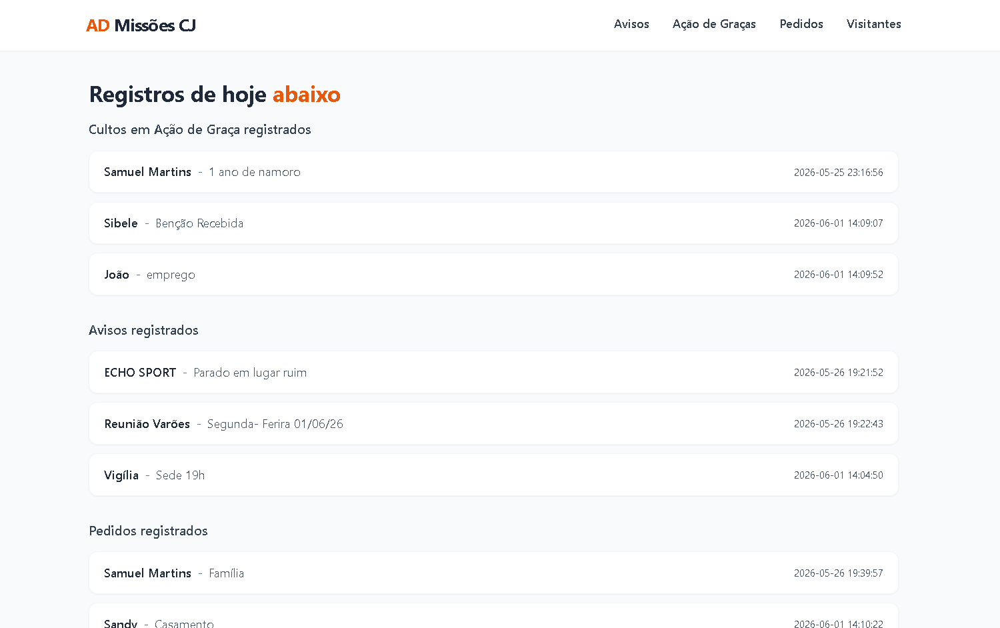
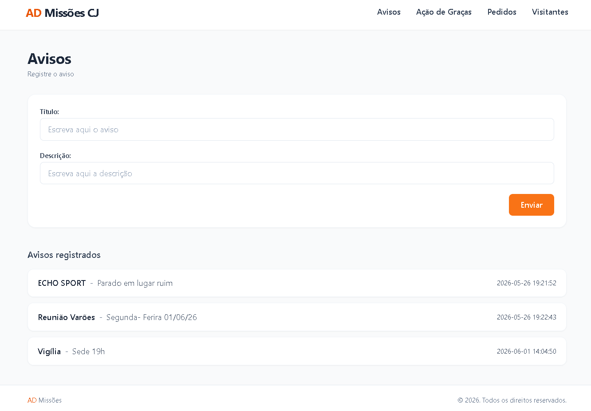
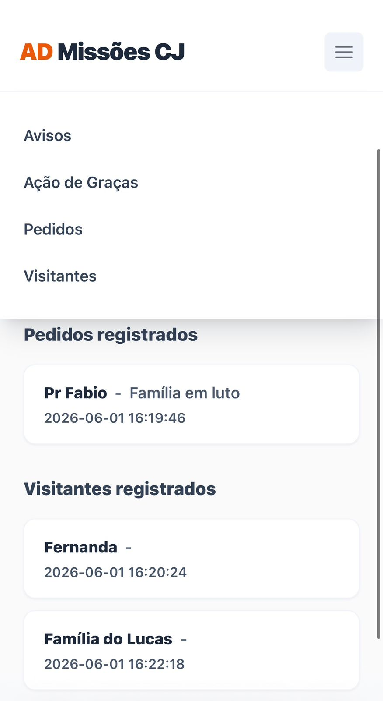
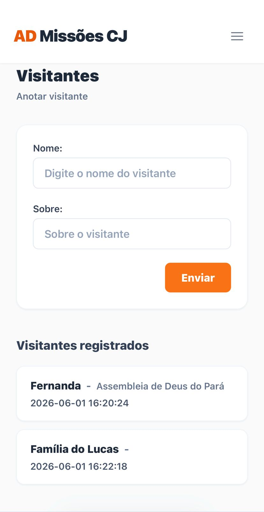

<h1 align="center">Missoo — Sistema de Gestão para Igrejas</h1>

<p align="center">
  Uma aplicação web desenvolvida em Python + Flask para facilitar a gestão de avisos, agradecimentos, pedidos de oração e visitantes de comunidades religiosas.
</p>

---

## Descrição do Sistema

O **Missao** é um sistema web criado para atender a uma demanda real de uma comunidade religiosa, centralizando o registro e exibição de informações como:

- **Avisos** internos da comunidade
- **Agradecimentos** enviados pelos membros
- **Pedidos de oração** cadastrados pelos participantes
- **Visitantes** recebidos nas reuniões

O projeto também tem como objetivo o desenvolvimento de competências práticas adquiridas em atividades universitárias, unindo aprendizado técnico com aplicação real.

---

## Tecnologias Utilizadas

| Camada | Tecnologia |
|---|---|
| **Front-end** | HTML5, Tailwind CSS, Jinja2 (templates) |
| **Back-end** | Python 3.10, Flask 3.1.3 |
| **Autenticação** | Sessão do Flask, senhas com hash SHA-256 |
| **Banco de Dados** | MySQL 8.0 |
| **Containerização** | Docker, Docker Compose |
| **Variáveis de Ambiente** | python-dotenv |

---

## Autenticação e Perfis de Acesso

O sistema exige login para qualquer acesso e possui dois perfis de usuário:

| Perfil | Pode visualizar | Pode criar | Pode editar | Pode excluir |
|---|---|---|---|---|
| **admin** | ✅ | ✅ | ✅ | ✅ |
| **usuario** (comum) | ✅ | ❌ | ❌ | ❌ |

- Quem não está logado é redirecionado para a tela de **login** (`/login`)
- Quem tenta uma ação restrita sem ser admin recebe a página de **acesso negado** (HTTP 403)
- O primeiro admin e o primeiro usuário comum são criados **automaticamente** na primeira inicialização do sistema, a partir de variáveis no arquivo `.env` (veja a seção [Como Configurar o `.env`](#como-configurar-o-env))

---

## Funcionalidades Principais

- **Login e Logout** — Acesso protegido por usuário e senha
- **Dois perfis de acesso** — Administrador (controle total) e Usuário comum (somente visualização)
- **Avisos** — Cadastro, edição, exclusão (com confirmação) e listagem de avisos da comunidade
- **Agradecimentos** — Envio, edição e exclusão de agradecimentos
- **Pedidos de Oração** — Cadastro, edição, exclusão e visualização dos pedidos
- **Visitantes** — Registro, edição e exclusão de visitantes que participaram das reuniões
- **Painel Principal** — Dashboard unificado com todos os dados em uma única tela
- **Deploy com Docker** — Ambiente totalmente containerizado para fácil implantação

---

## Prints das Telas

<p align="start">
  
  
  
  
</p>

---

## Estrutura de Pastas

```
Missao/
├── 📁 static
│   ├── 📁 prints
│   │   ├── 🖼️ avisos.png
│   │   ├── 🖼️ index.png
│   │   ├── 🖼️ indexmobile.png
│   │   └── 🖼️ visitantesmobile.png
│   └── 🎨 style.css
├── 📁 templates
│   ├── 🌐 acesso_negado.html
│   ├── 🌐 agradecimentos.html
│   ├── 🌐 avisos.html
│   ├── 🌐 base.html
│   ├── 🌐 confirmar_deletar.html
│   ├── 🌐 index.html
│   ├── 🌐 login.html
│   ├── 🌐 pedidos.html
│   └── 🌐 visitantes.html
├── ⚙️ .env.example
├── ⚙️ .gitignore
├── 🐳 Dockerfile
├── 📝 GUIA_USUARIO.md
├── 📝 README.md
├── 🐍 app.py
├── ⚙️ docker-compose.yaml
├── 📄 requirements.txt
└── 📄 script.sql
```

---

## Como Instalar o Projeto (sem Docker)

### Pré-requisitos

- Python 3.10+
- MySQL rodando localmente
- Git

### Passo a passo

```bash
# 1. Clone o repositório
git clone https://github.com/SamuelMartins00/Missao.git
cd Missao

# 2. Crie e ative o ambiente virtual
python3 -m venv venv

# Linux/macOS:
source venv/bin/activate

# Windows:
venv\Scripts\Activate

# 3. Instale as dependências
pip install -r requirements.txt

# 4. Configure o banco de dados
# Acesse o MySQL e execute o script:
mysql -u root -p < script.sql

# 5. Configure o arquivo .env (veja a seção abaixo)

# 6. Rode a aplicação
flask run
```

---

## Como Configurar o `.env`

Crie um arquivo `.env` na raiz do projeto (ou copie o `.env.example` já incluído no repositório) com as seguintes variáveis:

```env
# Banco de dados
DB_HOST=db
DB_USER=root
DB_PASSWORD=defina_uma_senha_forte
DB_NAME=igreja

# Usadas pelo container do MySQL (docker-compose)
MYSQL_ROOT_PASSWORD=defina_uma_senha_forte
MYSQL_DATABASE=igreja

# Flask — chave usada para assinar a sessão de login
SECRET_KEY=

# Admin inicial (criado automaticamente na primeira execução)
ADMIN_USUARIO=admin
ADMIN_SENHA=defina_uma_senha_forte

# Usuário comum inicial — só visualiza os dados (criado automaticamente)
USUARIO_COMUM_USUARIO=membro
USUARIO_COMUM_SENHA=defina_uma_senha_forte
```

> **Nunca comite o arquivo `.env` no repositório.** Ele já está listado no `.gitignore`.

| Variável | Descrição | Exemplo |
|---|---|---|
| `DB_HOST` | Host do banco de dados | `localhost` ou `db` (Docker) |
| `DB_USER` | Usuário do MySQL | `root` |
| `DB_PASSWORD` | Senha do usuário MySQL | `minhaSenhaForte123` |
| `DB_NAME` | Nome do banco de dados | `igreja` |
| `SECRET_KEY` | Chave usada pelo Flask para assinar o cookie de sessão. Gere uma com `python3 -c "import secrets; print(secrets.token_hex(32))"` | `a3f29c8e...` (64 caracteres) |
| `ADMIN_USUARIO` | Nome de usuário do administrador criado automaticamente no primeiro start | `admin` |
| `ADMIN_SENHA` | Senha do administrador (vira hash no banco, nunca fica em texto puro) | `minhaSenhaForte123` |
| `USUARIO_COMUM_USUARIO` | Nome de usuário do perfil somente-leitura criado automaticamente | `membro` |
| `USUARIO_COMUM_SENHA` | Senha do usuário comum (também vira hash) | `outraSenhaForte123` |

> As variáveis `ADMIN_USUARIO`/`ADMIN_SENHA` e `USUARIO_COMUM_USUARIO`/`USUARIO_COMUM_SENHA` só são necessárias **na primeira inicialização**, quando a tabela `usuarios` ainda está vazia. Depois de confirmar que o login de ambos funciona, você pode remover essas quatro linhas do `.env` sem afetar o funcionamento do sistema — os usuários já estarão salvos no banco.

---

## Como Rodar com Docker

### Pré-requisitos

```bash
# 1. Atualize os pacotes do sistema
sudo apt update

# 2. Instale o Docker
sudo curl -fsSL https://get.docker.com/ | sh

# 3. Verifique a instalação
sudo docker --version

# 4. (Opcional) Use Docker sem sudo — deslogue e logue novamente após o comando
sudo usermod -aG docker $USER

# 5. Instale o Docker Compose
sudo curl -SL https://github.com/docker/compose/releases/download/v2.27.0/docker-compose-linux-x86_64 -o /usr/local/bin/docker-compose

sudo chmod +x /usr/local/bin/docker-compose

# 6. Verifique
docker-compose --version
```

### Subindo a aplicação

```bash
# Clone o repositório
git clone https://github.com/SamuelMartins00/Missao.git
cd Missao

# Suba os containers (web + banco de dados)
docker-compose up -d

# Verifique se os containers estão rodando
docker ps

# Para derrubar a aplicação
docker-compose down
```

> O `docker-compose.yaml` já orquestra o banco MySQL e a aplicação Flask automaticamente. O banco é inicializado com o `script.sql` na primeira execução.

---

## Como Acessar o Sistema

Após subir a aplicação (com ou sem Docker), acesse pelo navegador:

```
http://localhost:5000
```

Você será redirecionado automaticamente para a tela de **login**. Use o usuário e senha definidos em `ADMIN_USUARIO`/`ADMIN_SENHA` (acesso total) ou `USUARIO_COMUM_USUARIO`/`USUARIO_COMUM_SENHA` (somente visualização) no seu `.env`.

| Rota | Descrição | Acesso |
|---|---|---|
| `/login` | Tela de login | Público |
| `/logout` | Encerra a sessão atual | Qualquer usuário logado |
| `/` | Painel principal (dashboard) | Qualquer usuário logado |
| `/avisos` | Listar e cadastrar avisos | Listar: todos · Cadastrar: admin |
| `/agradecimentos` | Listar e cadastrar agradecimentos | Listar: todos · Cadastrar: admin |
| `/pedidos` | Listar e cadastrar pedidos de oração | Listar: todos · Cadastrar: admin |
| `/visitantes` | Listar e cadastrar visitantes | Listar: todos · Cadastrar: admin |

A edição e exclusão de registros são feitas pelos botões **Editar** e **Deletar** dentro de cada listagem (visíveis apenas para o perfil admin) — a exclusão sempre passa por uma página de confirmação antes de remover o dado definitivamente.